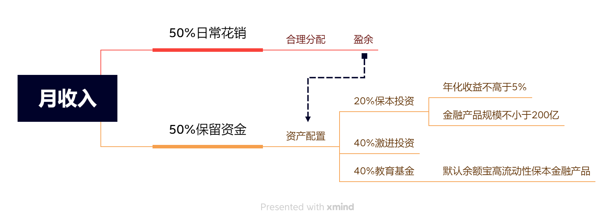
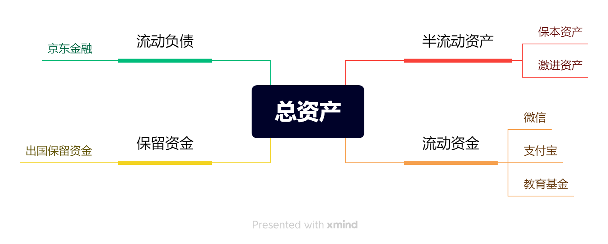
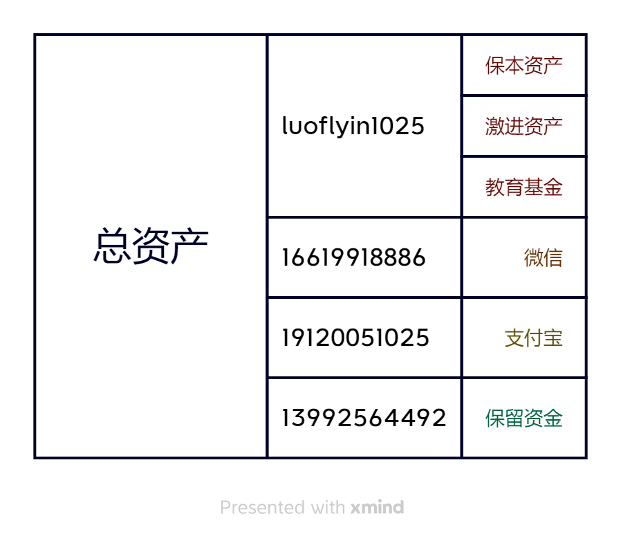

# 人生基本法
## 世界观
> 
## 人生观
> 请您尽可能的使用最小的时间及最低的金钱来撬动更高的资源，充实自己，惠及他人。
## 价值观
> 谦虚 诚实 感恩 善良
## 前言
> 请尽可能的谦虚、善良、关爱他人，这和我们的事业成就同样重要，永远记得学会为他人留一个位置，认识到运气和好的环境对你生命的重要意义，所以请一定要把机会分享给别人，因为你的机会也是别人给的。
## 00. 财务
收入分配

财报标准（每月向Ended提交财务报表xmind以及xls版本）

资产安排

> 每月流动资金向100取整，并计入保留资金
> [请月提交财产走势图](http://luofeixiang.com/lifelaw/images/fin.xlsx)
## 01. 作息
> * 01. 5:00起床（唤醒身体后请躺在床上5min使身体机能恢复后再起床并摄入温开水200ML）
> * 02. 22:30入睡（睡前2hours不进食不喝水+听英语）
## 02. 习惯
> * 01. 终身学习
> * 02. 每日摄入水2L
> * 03. 如有计划行程，请提前一天准备好所有行程必要的物品，并仔细检查
> * 04. 出门前请检查是否携带必要物品
> * 05. 早晚刷牙
> * 06. 用过的东西请放回原位。
> * 07. 出门带一包纸巾。
> * 08. 请给所有联系方式备注姓名
> * 09. 饭后半小时内请保持站立
## 03. 心态
> * 01. 请勿抱怨
> * 02. 请勿抱有任何期待，接受一切不确定的后果
## 04. 要求
> * 01. 诚实：可以相对隐瞒事实但不能讲出假话
> * 02. 禁止过度使用娱乐性产品（每日不超过5hours，月不超过20hours）
## 05. 待人
> * 01. 产生矛盾，学会主动给别人台阶下。要学会低头，不然很有可能因为一个小矛盾，就失去了一个盟友。
> * 02. 请保持外出给身边人买矿泉水的习惯
> * 03. 请保持尊重他人，认同他人。
> * 04. 经常把“谢谢你”挂嘴边，是友好待人最简单的表达方式
> * 05. 请勿随意负面的评价他人
> * 06. 多使用正面词汇以代替负面情绪
> * 07. 任何成果和成就都应和别人分享。
> * 08. 非必要不借钱，借钱时请向对方说明（还款截至日期/收款截至日期）。
> * 09. 去别人家做客，别两手空空
## 06. 讲话
> * 01. 请不要给任何人建议以及替他人做选择
> * 02. 结论先行
> * 03. 保持微笑讲话状态
> * 04. 倾听时用三分之一的时间看着他的眉心，三分之一的时间看眉心之外的脸庞，三分之一的时间不去看他
## 07. 健康
> * 01. 保持快速步行
> * 02. 非必要不摄入饮料
## 08. 消费
> * 01. 禁止购买一切没有回报的物品
> * 02. 如有必要请购买经济能力范围内最好的物品
> * 03. 钱只有一个下场就是被花掉，请不要吝啬，但也不要花费在没有价值的事物上
## 09. 时间

## 10. 计划
> * 01. [请每日向提交今日计划](http://luofeixiang.com/plan/dayily.png)
> * 02. [请每周向提交本周计划](http://luofeixiang.com/plan/weekly.png)
> * 03. [请每月向提交当月计划](http://luofeixiang.com/plan/monthly.png)
> * 04. [请每季度向提交当季度计划](http://luofeixiang.com/plan/quarterly.png)
> * 05. [请每年向提交当年计划](http://luofeixiang.com/plan/yearly.png)
## 11. 成长
